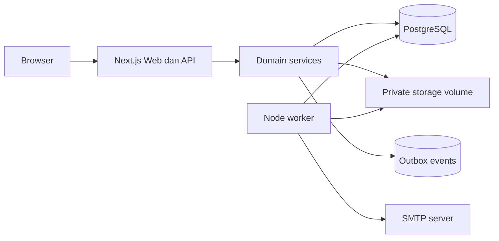

# SDD — Backend Mandiri Lelang Properti

Tanggal: 15 September 2026 | Versi: 2.1 | Status: Auth API development teruji; fitur lain bertahap

## 1. Keputusan arsitektur

Backend adalah modular monolith pada Next.js Route Handlers dan TypeScript. Tidak menggunakan Supabase, BaaS, MCP, SDK, atau schema pihak ketiga. PostgreSQL mandiri menjadi sumber kebenaran; Drizzle ORM/Kit mengelola query dan migrasi aplikasi. Storage, email, worker, observability, dan deployment dioperasikan tim aplikasi.

Rancangan menghindari microservice sampai beban, batas organisasi, atau kegagalan isolasi membuktikan kebutuhan. Tiap domain memiliki service, repository, schema, policy, dan validation. Route Handler hanya menangani HTTP, session context, request validation, response, dan error mapping.

## 2. Komponen

| Komponen | Tanggung jawab | Teknologi awal |
| --- | --- | --- |
| Web/API | UI, Route Handlers, BFF | Next.js + TypeScript |
| Domain | Rules listing, auth, review, lead, audit | Modul server aplikasi |
| Database | Source of truth dan transaksi | PostgreSQL + Drizzle |
| Auth | Google OIDC, session, preapproval akun | Google sebagai identity provider + modul aplikasi |
| Storage | Foto karantina/publik dan dokumen privat | Volume persisten + StorageAdapter |
| Worker | Email, media verification, close job | Proses Node terpisah + outbox PostgreSQL |
| Email | Notifikasi lead/review | SMTP adapter |
| Rate limit | Google start/callback, lead, upload | Tabel/database awal; Redis hanya saat multi-instance |
| Observability | Log, health, metrics, alert | JSON log, metrics endpoint, error tracker pilihan tim |

## 3. Diagram



## 4. Struktur kode target

```text
src/
  app/api/v1/{auth,properties,leads,admin,health}/
  modules/{auth,properties,leads,media,notifications,audit}/
  server/{auth,db,storage,email,queue,validation,observability}/
  workers/{deliver-outbox,process-media,close-auctions}.ts
scripts/{verify-database.ps1,verify-database.sql}
drizzle/
```

## 5. Data model

Schema PostgreSQL aplikasi adalah `app`; journal Drizzle adalah `drizzle`. Tidak ada schema auth eksternal.

| Tabel | Fungsi |
| --- | --- |
| `profiles` | Akun aplikasi dipraotorisasi: email unik, nama, phone, status, snapshot verifikasi Google |
| `user_roles` | Role `editor` dan `admin` |
| `user_sessions` | Session token hash, expiry, revocation, fingerprint minimal |
| `user_identities` | Binding immutable Google `sub` ke profile; email snapshot bukan identity key |
| `oauth_transactions` | State/browser/nonce/PKCE verifier hash, sekali pakai, expiry 10 menit |
| `properties` | Identitas listing, status publikasi/ketersediaan, harga, version |
| `property_revisions` | Snapshot konten untuk review/publish |
| `property_media` | Metadata file, lokasi storage, urutan, status, cover |
| `leads` | Minat pengunjung dan workflow follow-up |
| `audit_logs` | Jejak mutasi sensitif append-only |
| `outbox_events` | Pekerjaan setelah commit |
| `auth_rate_limits` | Kuota atomik start/callback global dengan key HMAC dan expiry |

`saleMode`, `publicationStatus`, dan `availabilityStatus` terpisah. Harga memakai `BIGINT` rupiah. Semua waktu memakai `TIMESTAMPTZ` UTC. `updatedAt` diperbarui service sampai trigger audit yang disetujui ditambahkan.

## 6. Auth mandiri

### 6.1 Akun

- MVP hanya menyediakan akun editor/admin yang dipraotorisasi. Tidak ada signup publik dan tidak ada password aplikasi.
- Login menggunakan Google OIDC Authorization Code flow dengan PKCE S256, state, nonce, exact redirect URI, dan validasi signature/issuer/audience/expiry ID token.
- Backend mengikat Google `sub` pertama kali ke profile dengan email yang telah dipraotorisasi. Role tidak pernah berasal dari Google claim; Google `sub`, bukan email, menjadi primary external identity.
- Binding pertama hanya untuk Gmail atau Google Workspace dengan claim hd dan email_verified=true. Email pihak ketiga harus diikat administrator berdasarkan sub terverifikasi, bukan kecocokan email saja.
- State/browser/nonce/verifier hanya tersimpan sebagai hash dalam transaksi PostgreSQL 10 menit. Cookie HttpOnly SameSite=Lax memegang browser secret dan PKCE verifier. DELETE RETURNING mengonsumsi transaksi sebelum code exchange, sehingga replay ditolak. Redirect setelah login tetap /account; tidak menerima return URL bebas.
- email_verified_at merekam waktu login terakhir dengan email_verified=true. Google access/refresh token tidak disimpan. Logout aplikasi tidak mengeluarkan akun dari Google.
- MFA administrator wajib sebelum produksi publik. TOTP/WebAuthn dipilih lewat ADR sebelum implementasi; jangan menciptakan protokol MFA sendiri.

### 6.2 Session

- Login menghasilkan token acak minimal 256-bit. Browser hanya menerima token; database menyimpan SHA-256 token hash.
- Cookie memakai `HttpOnly`, `Secure` pada HTTPS, `SameSite=Lax`, path `/`, dan expiry delapan jam awal. Cookie name dikonfigurasi dengan `AUTH_SESSION_COOKIE_NAME`.
- Setiap request privat mencocokkan hash, expiry, revokedAt, dan status profile dari PostgreSQL. Role dibaca server dari `user_roles`, bukan data browser/cookie claim.
- Logout mencabut satu session. Disable akun dan ubah role mencabut semua session akun.
- Mutasi browser memeriksa Origin yang diizinkan serta token CSRF signed double-submit yang terikat session. Start/callback Google, lead, dan upload memakai rate limit dan audit event.

### 6.3 Endpoint auth

| Method | Path | Fungsi |
| --- | --- | --- |
| GET | `/auth/google/start` | Membuat state/nonce/PKCE lalu redirect ke Google |
| GET | `/auth/google/callback` | Verifikasi callback/ID token, bind `sub`, buat session |
| POST | `/auth/logout` | Cabut session aktif |
| GET | `/me` | Identitas dan role current session |
| POST | `/auth/verify-email` | Konsumsi token verifikasi |

Status implementasi 15 September 2026: route Google start/callback, binding `sub`, session/logout, GET /api/v1/me, CSRF, dashboard terlindungi, katalog/detail PostgreSQL, listing workflow, media karantina, lead, audit, outbox, metrics, backup, dan restore test ephemeral tersedia. OAuth browser nyata masih memerlukan akun Google yang sudah dipraotorisasi; MFA dan mass revocation belum tersedia.

## 7. Storage mandiri

MVP memakai `STORAGE_ROOT` pada volume persisten yang dipasang di luar repository dan `public/`. Semua akses melalui interface `StorageAdapter`; backend tidak menyimpan path absolut ke client.

1. Editor meminta upload intent.
2. API memeriksa session, role, listing/revision, quota, MIME, dan ukuran.
3. File masuk area karantina privat dengan object key buatan server.
4. Worker memeriksa magic bytes, ukuran final, checksum, dan metadata.
5. Foto valid dipindahkan ke area publik aplikasi; dokumen legal tetap privat.
6. Media `ready` saja dapat dipakai revision published. Hapus memakai metadata soft delete dan cleanup job.

Batas awal: JPEG/PNG/WebP, maksimum 20 foto/revision, 5 MiB/foto. Jika aplikasi membutuhkan beberapa host, implementasi adapter kedua untuk object storage S3-compatible yang dikelola sendiri; interface dan policy tetap sama.

## 8. API, policy, dan error

Base URL `/api/v1`; JSON `camelCase`; UUID; waktu ISO 8601 UTC; cursor opaque maksimal 100 item. Error memiliki `code`, `message`, dan `requestId`.

- Publik: `GET /properties`, `GET /properties/{slug}`, `POST /leads`.
- Editor/admin: draft, revision, upload intent, submit review, read/update lead.
- Admin: antrean review, approve/revision/reject/archive, audit log, invitation.
- Setiap mutasi memakai Zod, policy server, audit event, dan optimistic version untuk edit listing.

Policy minimum: editor hanya bekerja pada scope yang diizinkan; admin review dan operasi pengguna; draft/revision/lead/dokumen privat selalu 404 untuk pihak tak berhak, bukan membocorkan keberadaannya.

## 9. Worker dan konsistensi

Tulis perubahan domain, audit event, dan outbox dalam transaksi PostgreSQL yang sama. Worker mengklaim batch dengan lock, menyimpan attempts dan availableAt, melakukan exponential backoff, dan memindahkan gagal permanen ke dead-letter status. Handler idempoten; kegagalan SMTP atau media tidak membatalkan lead/listing yang sudah committed.

## 10. Deployment

Produksi awal memakai host terkelola tim dengan service terpisah: `web`, `worker`, `postgres`, volume storage, dan SMTP relay. Database tidak memiliki port publik. Reverse proxy terminasi TLS untuk web saja. Backups PostgreSQL dan storage disalin terenkripsi ke lokasi kedua; restore drill rutin menentukan RPO/RTO aktual.

Environment lokal dapat memakai Docker Compose untuk PostgreSQL, Mailpit, web, worker, dan volume storage. Tidak ada dependency Supabase.

## 11. Keamanan dan operasi

- TLS, HSTS, CSP, X-Content-Type-Options, dan frame policy pada reverse proxy/aplikasi.
- Environment secret tervalidasi saat startup; secret tidak dipasang pada browser atau log.
- Role PostgreSQL runtime berbeda dari role migration. Runtime tidak boleh CREATE/ALTER/DROP schema.
- Parameter binding Drizzle; allowlist untuk filter/sort/MIME; sanitasi output user.
- Log JSON tanpa password, token, session cookie, reset URL, contact value lengkap, atau path privat.
- Backup, restore, rotate secret, revoke session, disable account, dan cleanup file memiliki runbook sebelum publik.

## 12. Testing

- Unit: OAuth state/nonce/PKCE lifecycle, token/session lifecycle, policy, validation.
- Integration PostgreSQL: migration, session revocation, unique/foreign/check constraints, outbox, cursor.
- E2E: Google login, dashboard, publish, lead, logout, upload.
- Security: CSRF, fixation, enumeration, IDOR, role escalation, rate limit, upload invalid.
- Recovery: database+file restore dan worker replay.

`scripts/verify-database.ps1` menjalankan SQL migrasi di database sementara, smoke test, rollback sintetis, dan cleanup. Script hanya cocok untuk lingkungan Docker PostgreSQL yang targetnya eksplisit.

## 13. Tahapan implementasi

1. Finalisasi schema Google OIDC, migration, role database, environment lokal.
2. Google login/logout/session/CSRF/rate limit/preapproval akun.
3. Property/revision workflow dan PostgreSQL read path.
4. StorageAdapter volume, media worker, dan migrasi foto prototype.
5. Leads, outbox, SMTP, dashboard metrik, audit.
6. Backup/restore, monitoring, hardening, staging, dan cutover SQLite.
7. Bidding hanya sesudah legal/product approval serta desain transaksi khusus.

## 14. Open decisions

- Google OAuth consent screen, admin preapproval workflow, library email, metrics/error tracker, reverse proxy, dan platform deployment.
- Provider/domain email, kebijakan retensi, MFA admin, backup region kedua, dan kapasitas storage.
- S3-compatible adapter saat lebih dari satu host dibutuhkan.
- Bidding, KYC, pembayaran, dan escrow tetap di luar MVP.

## 15. Hasil tahap development

Compose PostgreSQL/Mailpit lokal aktif, migrasi 0000–0003 diterapkan, role runtime terpisah, dan auth diuji melalui npm run test:auth dengan transport Google mock serta token RS256 sintetis. Login browser Google nyata menunggu OAuth client. Detail port, API, batas implementasi, dan perintah ada di docs/backend-setup.md. Baseline yang sudah diterapkan tidak boleh diregenerasi.
